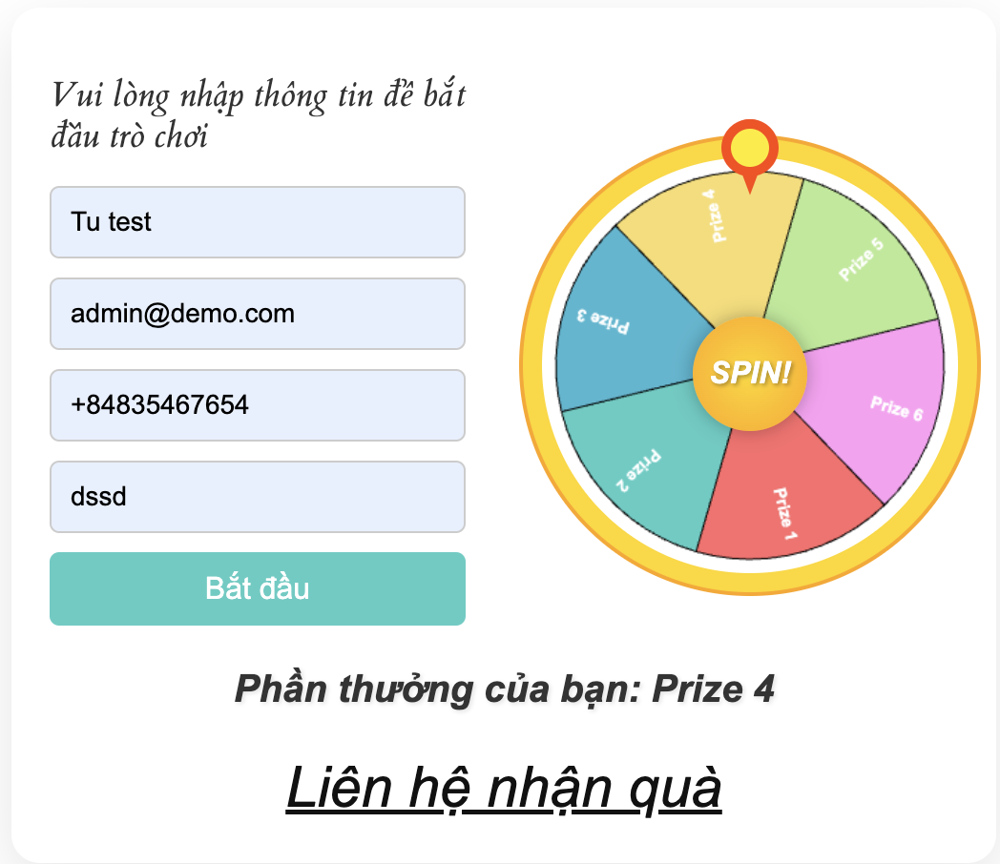

# Lucky Wheel WordPress Plugin



## Introduction

Lucky Wheel is an engaging and interactive WordPress plugin that adds a customizable spinning wheel to your website. Perfect for promotions, giveaways, or just adding a fun element to your site, Lucky Wheel allows visitors to spin and win prizes with a simple click.

## Features

- Easy to install and integrate with any WordPress site
- Fully customizable wheel segments (colors, labels, and probabilities)
- Smooth spinning animation with easing effects
- Responsive design that works on desktop and mobile devices
- Customizable number of spins per user
- Option to reset spins daily, weekly, or monthly
- Prize redemption system
- Admin panel for easy configuration
- Shortcode support for flexible placement

## Installation

1. Download the Lucky Wheel plugin zip file.
2. Log in to your WordPress admin panel.
3. Navigate to Plugins > Add New.
4. Click on the "Upload Plugin" button at the top of the page.
5. Choose the downloaded zip file and click "Install Now".
6. After installation, click "Activate Plugin".

## Usage

1. After activation, go to the Lucky Wheel settings page in your WordPress admin panel.
2. Configure the wheel segments, colors, and labels as desired.
3. Set the number of allowed spins and reset period.
4. To add the Lucky Wheel to a page or post, use the shortcode:

   ```
   [lucky_wheel]
   ```

5. Publish or update your page/post, and the Lucky Wheel will appear.

## Customization

You can customize various aspects of the Lucky Wheel through the admin panel:

- Number of wheel segments
- Colors and labels for each segment
- Probability of winning for each segment
- Number of spins allowed per user
- Reset period for spins (daily, weekly, monthly)
- Wheel design (classic, neon, etc.)

## Troubleshooting

If you encounter any issues:

1. Ensure your WordPress version is up to date.
2. Check that the plugin is properly activated.
3. Clear your browser cache and try again.
4. If problems persist, please contact our support team.

## Support

For support, feature requests, or bug reports, please open an issue on our GitHub repository or contact our support team at support@example.com.

## License

This plugin is licensed under the GPL v2 or later.

---

We hope you enjoy using the Lucky Wheel plugin! If you find it helpful, please consider leaving a review on our WordPress plugin page.